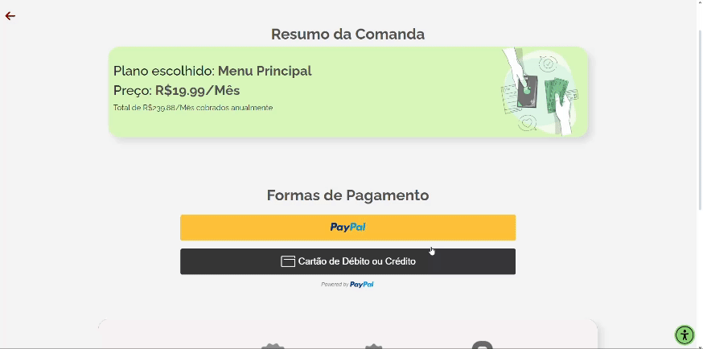

## Documentação da API de Pagamento do PayPal

### Descrição Geral
A API de Pagamento do PayPal oferece uma gama de funcionalidades para integrar pagamentos em sites e aplicativos, permitindo a aceitação de diversas formas de pagamento, incluindo cartões de crédito, débito e carteiras digitais como o PayPal e Venmo. A API é baseada em REST e utiliza o OAuth 2.0 para autenticação, garantindo segurança nas transações.

### Benefícios
- **Flexibilidade**: Suporta uma variedade de métodos de pagamento e pode ser integrada de diversas formas (Checkout Padrão, Avançado, Sem Código, e Enterprise).
- **Segurança**: Usa OAuth 2.0 para autenticação e oferece ferramentas avançadas de proteção contra fraudes.
- **Escalabilidade**: Adequada para negócios de todos os tamanhos, desde pequenas lojas online até grandes empresas.

### Integração com a API
Integramos o Paypal no ReactJS utilizando API, [veja como fizemos isso](https://github.com/1fellype/pagamento-saboria).

### Segurança
Utilizamos Sandbox para ser apenas um "teste" de pagamento, não cobramos realmente do nosso cliente.

### Recursos Adicionais
- **Documentação Detalhada**: A documentação completa, incluindo guias de integração e exemplos de código, pode ser encontrada no [site de desenvolvedores do PayPal](https://developer.paypal.com/home/).